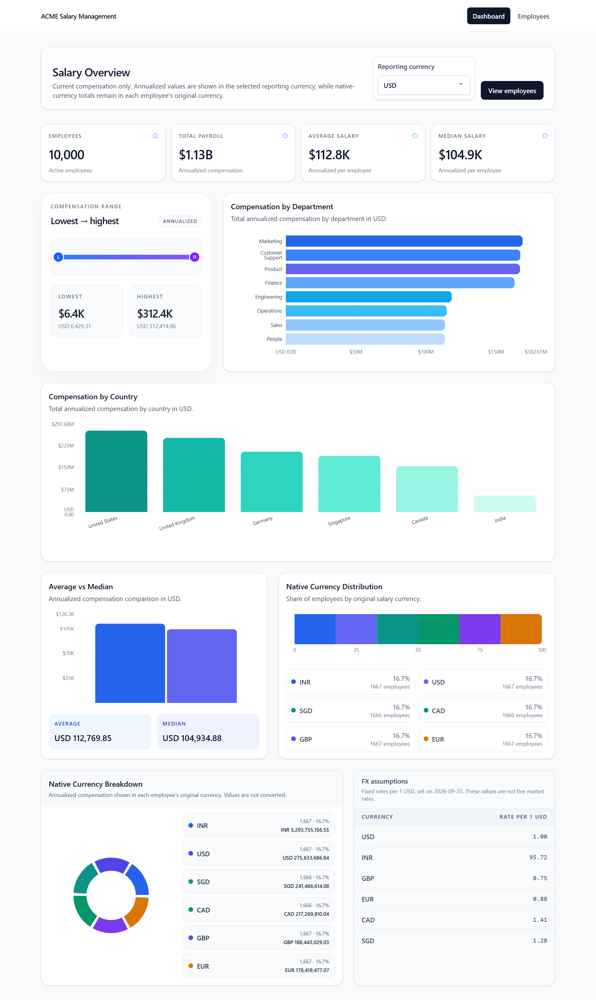
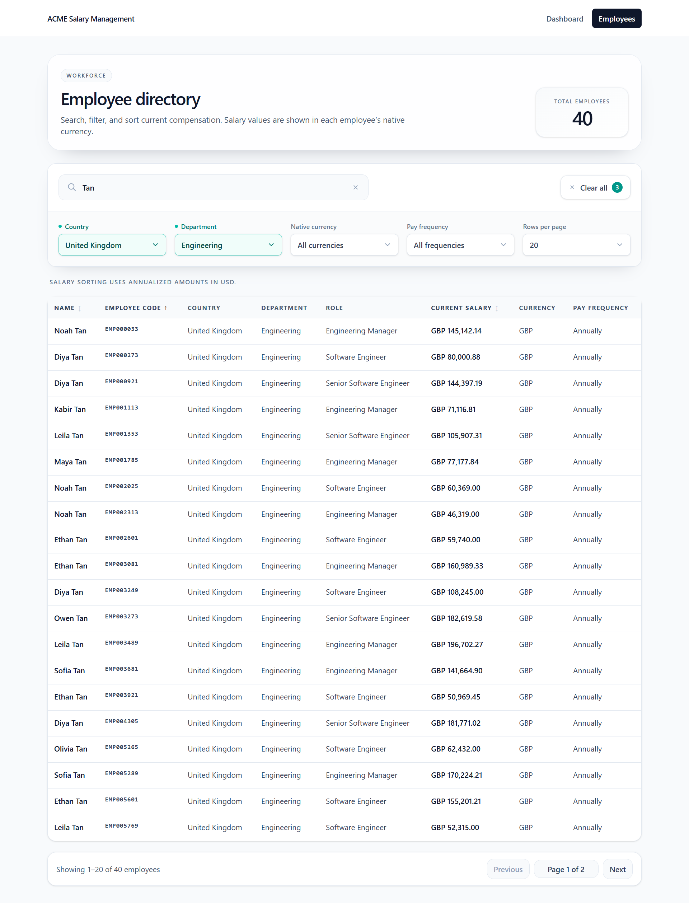
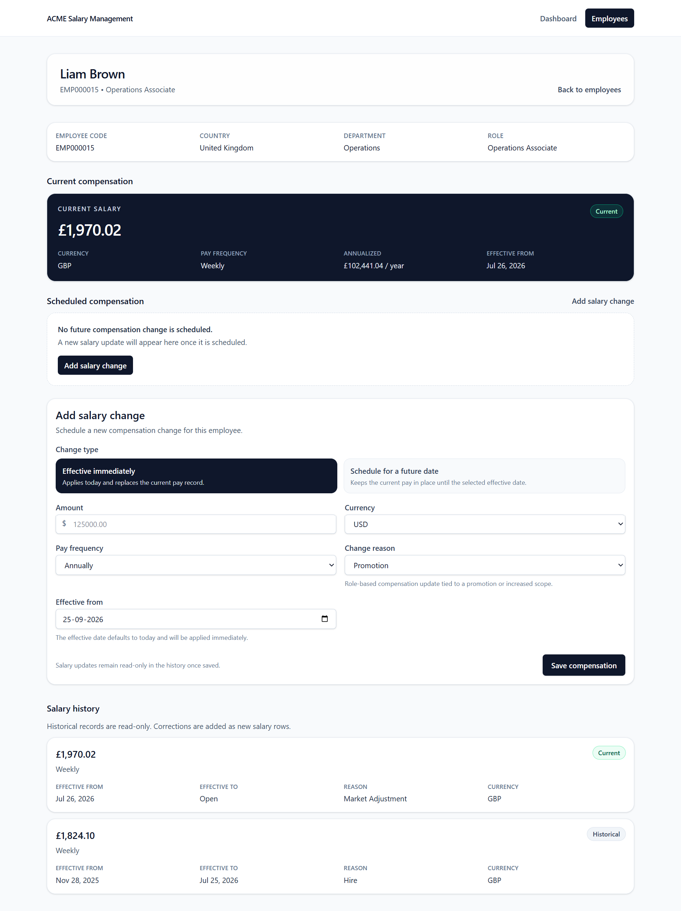

# ACME Salary Management

This repository contains the completed assessment for ACME’s salary-management application: a full-stack HR dashboard that lets an HR manager search employees, review compensation history, schedule salary changes, and view analytics across departments, countries, and reporting currencies.

## Product summary

- Frontend: Next.js + React + TypeScript
- Backend: Express + TypeScript + PostgreSQL
- Data set: 10,000 seeded employee records
- Core use cases: employee lookup, compensation updates, salary analytics, and historical pay tracking

## What is implemented

- Employee directory with search, filtering, sorting, and server-side pagination
- Employee detail page showing current pay, scheduled future pay, and a full compensation history
- Salary update form that creates a compensation record with validation and transaction-safe persistence
- Dashboard covering headcount, total pay, average, median, range, country/department breakdown, and FX-rate context
- Shared salary math for annualized values and reporting-currency conversion

## Major screens

### 1. Dashboard

Route: `/`

The home screen shows current compensation summary metrics in a selected reporting currency, including annual totals, averages, medians, minimums, maximums, country and department breakdowns, and the fixed FX-rate reference table. It also links to the employee directory.

### 2. Employee directory

Route: `/employees`

The employee list supports searching by name or employee code, filtering by country, department, currency, and pay frequency, and sorting by name, employee code, or salary. Pagination and sort are handled on the server side.

### 3. Employee detail

Route: `/employees/[id]`

The employee detail view shows the employee’s read-only profile metadata, current compensation, scheduled future compensation, a form for adding a salary change, and the full salary history. Historical records are read-only; corrections are added as new compensation rows.

## Architecture

The system is a simple modular monolith:

- Frontend: Next.js app routes and reusable UI components
- Backend: Express API with three modules: employees, compensations, and analytics
- Persistence: PostgreSQL with relational employee and compensation tables
- Shared logic: salary annualization and currency conversion rules live in shared server-side logic

The backend exposes the following main API routes:

- `GET /api/v1/employees`
- `GET /api/v1/employees/:id`
- `GET /api/v1/employees/:id/compensations`
- `POST /api/v1/employees/:id/compensations`
- `GET /api/v1/analytics/salary`

## Running the app locally

### Backend

1. Open a terminal in the `backend` folder.
2. Copy the example env file:
   - PowerShell: `Copy-Item .env.example .env`
   - macOS/Linux: `cp .env.example .env`
3. Update `DATABASE_URL` to a local PostgreSQL connection string.
4. Install dependencies:
   - `npm install`
5. Start the API:
   - `npm run dev`

The API listens on `http://localhost:3000` by default. `CORS_ORIGINS` is set to allow `http://localhost:3001`.

### Frontend

1. Open a terminal in the `frontend` folder.
2. Copy the example env file:
   - PowerShell: `Copy-Item .env.example .env.local`
   - macOS/Linux: `cp .env.example .env.local`
3. Install dependencies:
   - `npm install`
4. Start the Next.js app on a port that does not conflict with the API:
   - `npm run dev -- --port 3001`

The frontend uses `NEXT_PUBLIC_API_BASE_URL` (default: `http://localhost:3000`) to reach the backend.

## Verification

The repository was checked with fresh verification commands:

- Backend: `cd backend; npm test -- --runInBand` → 12/12 test suites passed, 152/152 tests passed
- Frontend: `cd frontend; npm run build` → production build succeeded
- Frontend: `cd frontend; npm test -- --runInBand` → 9/9 test suites passed, 28/28 tests passed

## Security and repo hygiene

- The leaked backend environment file containing a database URL was removed.
- The repo now ignores `.env` and `.env.*` files while preserving example files like `.env.example`.
- No deployment URL, credentials, or live secret values are documented in this repository.

## Submission readiness

This repository is prepared for sharing with Incubyte as a code submission for the assessment. It includes the working implementation, matching documentation, and verified local test/build evidence without adding unapproved refactors or API/schema changes.
